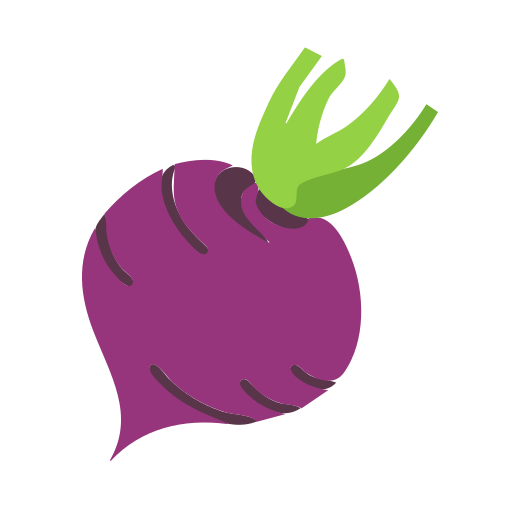

# turnip-rs

<div align="center">
     
</div>

Ternary operators (turnips) for Rust.

Rather than creating a functional procedural macro to parse yet-another domain-specific syntax (a language within a language), `turnip` provides the simplest possible solution. The result is recursion without additional function calls and consistency with Rust syntax rules, which does not support overloading the `?` and `:` operators.

The solution is a single 10-line macro defined using `macro_rules!`. [See for yourself](./src/lib.rs). Unlike other solutions out there, such as [terny](https://github.com/KaitlynEthylia/terny), [tern](https://github.com/lmburns/tern), [iffy](https://github.com/zfzackfrost/iffy-rs) and [ternop](https://github.com/spacekookie/ternop.rs), `turnip` combines simplicity with built-in support for recursion to more closely match a ternary operator design pattern.

What more do you need?

## Installation

```shell
cargo add turnip
```

## Usage

Create a new crate and add `turnip`:

```shell
cargo init
cargo add turnip
```

Open `src/main.rs` and import the `ifelse!` macro:

```rust
// main.rs
use turnip::ifelse;

fn main() {

    let result1: bool = ifelse!(10 < 0, true, false);
    let result2: bool = ifelse!(10 < 0, true, 10 == 0, true, false);
    assert!(result1 == result2);

}
```

Compile and run the project:

```shell
cargo build
cargo run
```

## License

MIT License
